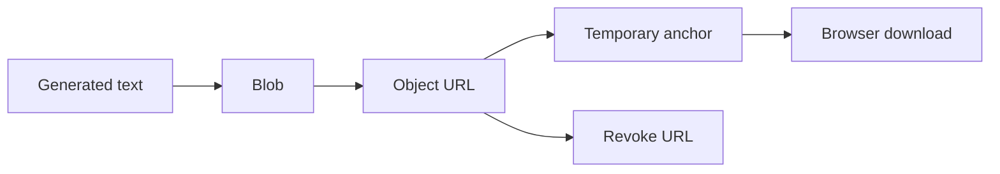
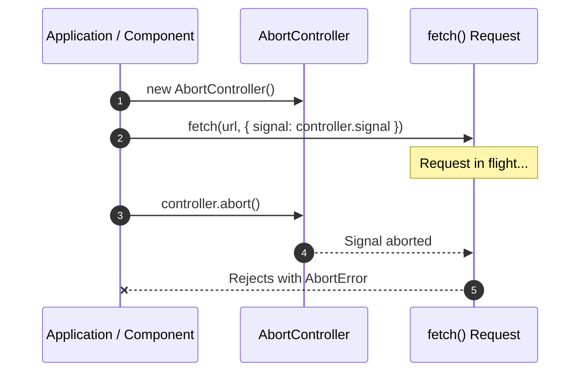

# JavaScript Learning Log

A running personal collection of JavaScript rules of thumb, good practices, and lessons learned, gathered day after day while working on real projects (but written generically so they're useful anywhere).

Entries are logged chronologically (oldest first). This log will be reorganized into logical chapters once it grows large enough to need them — see the `js-learning` skill for how new entries are added.

## Index

1. [Empty string vs `null` for initial values](#1-empty-string-vs-null-for-initial-values)
2. [Dynamic object properties with bracket notation](#2-dynamic-object-properties-with-bracket-notation)
3. [Truthy and falsy values](#3-truthy-and-falsy-values)
4. [Download generated content with a Blob and temporary link](#4-download-generated-content-with-a-blob-and-temporary-link)
5. [Cancelling asynchronous tasks with AbortController and AbortSignal](#5-cancelling-asynchronous-tasks-with-abortcontroller-and-abortsignal)
6. [Use `link:` for live local pnpm dependency development](#6-use-link-for-live-local-pnpm-dependency-development)

## Entries

### 1. Empty string vs `null` for initial values

When initializing a property/variable, the choice between `''` and `null` should be driven by how the value is used later, not by habit:

- Use **`''`** when the value is always treated as a string — you'll call string methods on it (`.trim()`, `.length`, `.slice()`, etc.) or bind it directly into a template/input that expects a string. This avoids `TypeError: Cannot read properties of null` crashes.
- Use **`null`** when the value is an optional reference or ID that may not exist yet — especially if it will be serialized into a JSON payload sent to an API. `null` explicitly communicates "no value", whereas `''` could be misread by the receiving side as a real but blank value.
- Mixing the two up is a common source of bugs: calling `.trim()` on a `null` throws; sending `''` where an API expects "absent" can silently break "is this new?" logic on the backend.

```js
class ChatState {
  constructor() {
    // Always used with string methods / template bindings -> safe string default
    this.draftText = '';

    // Optional external reference, not created yet -> explicit "no value"
    this.threadId = null;
  }

  submit() {
    const trimmed = this.draftText.trim(); // safe: draftText is always a string

    return {
      thread_id: this.threadId, // null tells the API "start a new thread"
      message: trimmed,
    };
  }
}
```

**Further reading:** [MDN Web Docs: null](https://developer.mozilla.org/en-US/docs/Web/JavaScript/Reference/Operators/null)

### 2. Dynamic object properties with bracket notation

Bracket notation, `object[expression]`, evaluates the expression inside the brackets and uses its result as the property key. This makes it useful for lookup tables when the property to read comes from a variable; `itemsByType[type]` is equivalent to `itemsByType['client']` when `type` contains `'client'`.

Dot notation such as `itemsByType.type` searches for a literal property named `type`, so it is not interchangeable with bracket notation. A fallback such as `|| []` can provide a safe default when the computed key does not exist in the object.

```js
const fruits = {
  apple: 'winter fruit',
  banana: 'summer fruit'
};

const selectedFruit = 'apple';

fruits[selectedFruit]; // 'winter fruit'
fruits.apple; // 'winter fruit'
fruits[selectedFruit] || 'unknown fruit'; // Safe fallback if the key is missing
```

**Further reading:** [MDN Web Docs: Property accessors](https://developer.mozilla.org/en-US/docs/Web/JavaScript/Reference/Operators/Property_accessors)

### 3. Truthy and falsy values

JavaScript evaluates every value as either truthy or falsy when it is used in a boolean context, such as an `if` condition or with the logical NOT operator (`!`). The complete set of falsy values is `false`, `0`, `-0`, `0n`, `NaN`, `''`, `null`, and `undefined`; all other ordinary JavaScript values are truthy, including empty arrays (`[]`) and empty objects (`{}`).

The `!` operator first converts a value to a boolean and then reverses it. Therefore, `!value` is `true` for any falsy value and `false` for any truthy value. For example, `!country` is `true` when `country` is `undefined` or an empty string, so it can disable a button until a non-empty country value is selected.

```js
const falsyValues = [false, 0, -0, 0n, NaN, '', null, undefined];

falsyValues.forEach(value => {
  Boolean(value); // false
  !value;         // true
});

Boolean('Spain'); // true: every non-empty string is truthy
Boolean([]);      // true: an empty array is still an object
Boolean({});      // true: an empty object is still an object

let country;
!country; // true because country is undefined

country = '';
!country; // true because country is an empty string

country = 'Spain';
!country; // false because country is a non-empty string
```

**Further reading:** [MDN Web Docs: Falsy](https://developer.mozilla.org/en-US/docs/Glossary/Falsy) and [MDN Web Docs: Truthy](https://developer.mozilla.org/en-US/docs/Glossary/Truthy)

### 4. Download generated content with a Blob and temporary link

When a browser application needs to download content that was generated in JavaScript, it can create a `Blob`. A `Blob` is a file-like object that stores raw data plus a MIME type, such as `text/csv;charset=utf-8` for a CSV file.

The browser cannot download a `Blob` directly from memory, so the code creates a temporary object URL with `URL.createObjectURL(blob)`. That URL points to the in-memory data, and a temporary `<a>` element with a `download` attribute tells the browser to save it as a file instead of navigating to it.

After triggering the click, revoke the object URL with `URL.revokeObjectURL(url)`. Revoking releases the memory associated with the generated URL, which matters when users download large files or repeat the action many times.

```js
function downloadCsvTemplate() {
  const headers = ['name', 'email', 'country'];
  const csvContent = `${headers.join(',')}\r\n`;

  // The Blob stores the generated file content and identifies it as CSV text.
  const file = new Blob([csvContent], {
    type: 'text/csv;charset=utf-8'
  });

  // Object URLs let DOM APIs reference file-like data created in memory.
  const url = URL.createObjectURL(file);
  const link = document.createElement('a');

  link.href = url;
  link.download = 'template.csv';
  document.body.appendChild(link);
  link.click();
  link.remove();

  // Revoke after the click so the browser has time to start the download.
  setTimeout(() => URL.revokeObjectURL(url), 1000);
}
```



Read this flow from left to right: JavaScript turns generated content into a file-like `Blob`, exposes it through a temporary URL, uses an anchor click to start the download, and then revokes the URL to clean up memory.

**Further reading:** [MDN Web Docs: Blob](https://developer.mozilla.org/en-US/docs/Web/API/Blob) and [MDN Web Docs: URL.createObjectURL()](https://developer.mozilla.org/en-US/docs/Web/API/URL/createObjectURL_static)

### 5. Cancelling asynchronous tasks with AbortController and AbortSignal

Asynchronous operations, such as fetching data from a network server with `fetch()`, take unpredictable time to complete. In web applications, situations frequently arise where an active network request is no longer needed:

- A user navigates away from a page or closes a component while data is still downloading.
- A user types rapidly into a search field, triggering a new search request before the previous search response arrives.
- A component is unmounted or destroyed during cleanup.

Without a way to cancel pending requests, late-arriving responses can cause race conditions (where an older request overwrites newer data), waste network bandwidth, or cause errors by updating state on a component that no longer exists.

The `AbortController` API provides a standard mechanism to cancel asynchronous tasks on demand. It consists of two complementary objects:

- **`AbortController`**: The controller object that triggers cancellation when its `controller.abort()` method is called.
- **`AbortSignal`**: The signal object accessed via `controller.signal`. This signal is passed as an option to abortable operations (such as `fetch(url, { signal })`) so the operation knows when to cancel.

When `controller.abort()` is called, any active `fetch` request attached to that signal is cancelled immediately. The `fetch` Promise rejects with a DOMException whose `name` property is `'AbortError'`. Catching this specific error name allows code to handle intentional cancellations cleanly without logging them as unexpected failures.



Read this sequence from top to bottom: The application instantiates an `AbortController`, passes its `signal` to a `fetch` request, and later calls `controller.abort()`. The controller notifies the request via the signal, causing `fetch` to cancel immediately and reject its Promise with an `AbortError`.

```js
class UserProfileLoader {
  constructor() {
    this.controller = null;
  }

  async loadUserData(userId) {
    // 1. Cancel any previous request still in flight
    if (this.controller) {
      this.controller.abort();
    }

    // 2. Create a fresh controller for the new request
    this.controller = new AbortController();

    try {
      const response = await fetch(`/api/users/${userId}`, {
        signal: this.controller.signal,
      });

      if (!response.ok) {
        throw new Error(`Server status ${response.status}`);
      }

      return await response.json();
    } catch (error) {
      // 3. Ignore AbortError since it was triggered intentionally
      if (error.name === 'AbortError') {
        console.log('Request was cancelled intentionally');
      } else {
        console.error('Failed to load user data:', error);
      }
      return null;
    } finally {
      this.controller = null;
    }
  }

  // 4. Clean up pending network requests when tearing down
  cleanup() {
    if (this.controller) {
      this.controller.abort();
      this.controller = null;
    }
  }
}
```

#### Selective Line-by-Line Walkthrough

```js
this.controller = new AbortController();
```

Creates a new instance of `AbortController`. This controller owns a unique `signal` property and an `abort()` method used to trigger cancellation.

---

```js
const response = await fetch(`/api/users/${userId}`, {
  signal: this.controller.signal,
});
```

Passes `this.controller.signal` to `fetch` options. The browser links the network request to this signal. If the signal aborts while the request is still pending, `fetch` aborts the HTTP request immediately.

---

```js
if (error.name === 'AbortError') {
  console.log('Request was cancelled intentionally');
}
```

Differentiates an intentional cancellation from genuine network or server errors. When `abort()` is invoked, the `fetch` Promise rejects with a DOMException named `'AbortError'`. Checking `error.name` allows applications to silence or log cancellation safely.

---

```js
cleanup() {
  if (this.controller) {
    this.controller.abort();
    this.controller = null;
  }
}
```

Teardown method to ensure no network requests remain running when a component is destroyed or unmounted. Calling `abort()` cleans up resources and prevents post-unmount state updates.

**Further reading:** [MDN Web Docs: AbortController](https://developer.mozilla.org/en-US/docs/Web/API/AbortController) and [MDN Web Docs: AbortSignal](https://developer.mozilla.org/en-US/docs/Web/API/AbortSignal)

### 6. Use `link:` for live local pnpm dependency development

When a JavaScript project uses pnpm, a dependency declared with `file:/absolute/path/to/package` is best understood as a local package snapshot. pnpm installs that package into the consuming project, but later edits in the source package are not guaranteed to appear after a plain `pnpm install` because the dependency specification did not change.

Use `link:/absolute/path/to/package` when the consuming app should read directly from a local package while both projects are being edited. Use `workspace:*` when both packages are part of the same pnpm workspace, because that lets pnpm resolve the dependency through the workspace instead of treating it as an external package.

Development servers can add a second layer of caching. For example, Vite prebundles dependencies into `node_modules/.vite`; after changing a linked local dependency, clear that cache and restart the dev server if the browser still runs stale code.

| Dependency spec | Best use case | Update behavior |
| --- | --- | --- |
| `file:/path/to/package` | Installing a local package snapshot | May require reinstalling with `--force` to refresh changes |
| `link:/path/to/package` | Live local development across two folders | Reads from the linked local folder |
| `workspace:*` | Packages inside the same pnpm workspace | Resolves through the workspace |

```json
{
  "dependencies": {
    "my-local-package": "link:/Users/me/projects/my-local-package"
  }
}
```

```bash
# After switching from file: to link:, reinstall dependencies.
pnpm install

# If the app uses Vite and stale dependency code still appears, clear the prebundle cache.
rm -rf node_modules/.vite
```

**Further reading:** [pnpm: Working with linked packages](https://pnpm.io/cli/link) and [Vite: Dependency pre-bundling](https://vite.dev/guide/dep-pre-bundling)
